# THE ONE, THE MANY, AND THE NO-ONE

An interactive narrative exploring the nature of reality, interpretation, and identity in a world where multiple truths can coexist without resolution.

## About the Book

You are Aleksy Wrona, a person with unusual perception who experiences multiple versions of reality. When your perception becomes impossible to ignore, you find yourself fighting for your right to exist in a world that insists reality must be singular.

The story follows your journey from discovery through legal battle, from threshold choice to convergence, from personal transformation to the restructuring of reality itself. Along the way, you must navigate your relationship with Mira—your emotional anchor whose developing perception creates a timing mismatch that threatens to pull you apart—and seek guidance from Sava Illich, an independent researcher who understands what you're becoming.

At the threshold, you must make a choice: stay in this version with Mira, risking instability to preserve your connection, or shift to a version where multiplicity is the norm, finding belonging at the cost of physical proximity. Either choice leads to a life where you become a bridge between realities, helping others who are developing unusual perception understand what they're experiencing.

The story explores philosophical questions about the nature of identity, the value of connection, and whether reality must be singular or can genuinely be multiple. It's about the freedom to choose—and the responsibility to live with that choice.

## Main Characters

- **Aleksy Wrona (You)**: The protagonist. A person with unusual perception who experiences multiple versions of reality. You represent the causal perspective—trained to seek linear truth through precise chronological sequences and unbroken chains of cause and effect. Your journey from discovery through legal battle to threshold choice drives the narrative.

- **Mira**: Your emotional anchor and love interest. Mira represents the emotional perspective—trusting intuition and feeling over linear logic, believing that emotional truth is equally valid regardless of timing. As the story progresses, Mira's developing perception creates a timing mismatch that threatens to pull you apart, forcing you to make a difficult choice at the threshold.

- **Dr. Kaczmarek**: An ally within the system who believes in understanding. He works for the institution that seeks to suppress unusual perception, but he goes against his employers to support your journey. He believes your perception is real and is willing to help you find answers.

- **Sava Illich**: An independent researcher who understands what you're becoming. Sava becomes your guide through the threshold, helping you understand your perception, navigate the choice to stay or shift, and live with the consequences. She represents the bridge between institutional knowledge and lived experience.

## Features

- **Branching Narrative**: Navigate complex story paths with conditional choices
- **State Management**: Track variables, flags, and player progress
- **Resolution Paths**: Two main endings based on your threshold choice (stay or shift)
- **Philosophical Depth**: Explore questions about identity, connection, and the nature of reality
- **Character Development**: Build relationships with Mira, Dr. Kaczmarek, and Sava Illich

## Architecture

The system is divided into 4 layers:

1. **Content Layer** (YAML / DB)
2. **Engine Layer** (state + execution)
3. **UX Layer** (rendering + interaction)
4. **Tooling Layer** (graph, replay, analytics - optional)

### Architecture Diagram

```mermaid
graph TD
    A[Browser] --> B[Interactive Novel Engine]
    
    B --> C[Content Layer]
    B --> D[Engine Layer]
    B --> E[UX Layer]
    B --> F[Tooling Layer]
    
    subgraph "Content Layer"
        C --> G[YAML Adapter]
        C --> H[Database Adapter]
        G --> I[Book.yaml]
        G --> J[Chapters/]
        G --> K[Nodes/]
        H --> L[External Database]
    end
    
    subgraph "Engine Layer"
        D --> M[State Manager]
        D --> N[Node Lifecycle]
        D --> O[Chapter System]
        D --> P[Condition Evaluator]
        D --> Q[Progress Tracker]
        
        M --> R[Variables Store]
        M --> S[Flags Store]
        M --> T[Player Progress]
        N --> U[Node Execution]
        O --> V[Chapter Navigation]
        P --> W[Conditional Logic]
        Q --> X[Save System]
    end
    
    subgraph "UX Layer"
        E --> Y[DOM Renderer]
        E --> Z[Input Handler]
        E --> AA[UI Components]
        E --> BB[Responsive Design]
        
        Y --> CC[Text Display]
        Y --> DD[Choice Buttons]
        Z --> EE[Click Events]
        Z --> FF[Keyboard Events]
        AA --> GG[Navigation]
        AA --> HH[Progress Bar]
        BB --> II[Mobile Layout]
        BB --> JJ[Desktop Layout]
    end
    
    subgraph "Tooling Layer"
        F --> KK[Story Graph]
        F --> LL[Replay System]
        F --> MM[Analytics]
        F --> NN[Debug Tools]
        
        KK --> OO[Node Connections]
        KK --> PP[Path Visualization]
        LL --> QQ[Session Recording]
        LL --> RR[Playback Engine]
        MM --> SS[Choice Analytics]
        MM --> TT[Progress Metrics]
        NN --> UU[Variable Inspector]
        NN --> VV[Condition Debugger]
    end
    
    subgraph "Narrative Structure"
        I --> WW[Book Metadata]
        J --> XX[Chapter Definitions]
        K --> YY[Node Content]
        YY --> ZZ[Text Content]
        YY --> AAA[Choice Options]
        AAA --> BBB[Stay Path]
        AAA --> CCC[Shift Path]
        BBB --> DDD[Mira Relationship]
        CCC --> EEE[Sava Guidance]
    end
    
    subgraph "Character System"
        DDD --> FFF[Aleksy - Protagonist]
        DDD --> GGG[Mira - Emotional Anchor]
        DDD --> HHH[Dr. Kaczmarek - Ally]
        DDD --> III[Sava Illich - Guide]
        FFF --> JJJ[Causal Perspective]
        GGG --> KKK[Emotional Perspective]
    end
    
    subgraph "Philosophical Themes"
        LLL[Nature of Reality] --> MMM[Singular vs Multiple]
        NNN[Identity Questions] --> OOO[Personal Transformation]
        PPP[Connection Value] --> QQQ[Relationship Dynamics]
        RRR[Choice & Responsibility] --> SSS[Threshold Decision]
    end
    
    subgraph "Storage"
        X --> TTT[localStorage]
        Q --> TTT
        T --> UUU[Session Storage]
    end
    
    subgraph "Build System"
        VVV[Vite Build] --> WWW[TypeScript]
        VVV --> XXX[Single File Output]
        VVV --> YYY[GitHub Pages Ready]
    end
```



## Project Structure

```
interactive-book-engine/
├── src/
│   ├── adapters/       # Data loading adapters (YAML, DB)
│   ├── core/           # Core engine (conditions, evaluation)
│   ├── engine/         # Node lifecycle, chapter system
│   ├── renderer/       # DOM-based UI renderer
│   ├── state/          # State management
│   ├── types/          # TypeScript type definitions
│   ├── utils/          # Utilities (progress, etc.)
│   ├── app.ts          # Main application entry point
│   └── styles.css      # Responsive styling
├── content/            # Book content (YAML files)
│   ├── book.yaml
│   ├── chapters/
│   └── nodes/
├── .github/workflows/  # CI/CD for GitHub Pages
├── index.html
├── package.json
├── tsconfig.json
└── vite.config.ts
```

## Getting Started

### Prerequisites

- Node.js 20 or higher
- npm or yarn

### Installation

```bash
# Install dependencies
npm install

# Start development server
npm run dev

# Build for production
npm run build

# Preview production build
npm run preview
```

## Content Specification

### Book Structure

```yaml
title: "The Last Signal"
chapters:
  - chapter_1
  - chapter_2

arcs:
  introduction:
    pacing:
      frameDelay: 500
      suspense: "low"
    visuals:
      tone: "mysterious"
```

### Chapter

```yaml
id: chapter_1
title: "The Arrival"
arc: introduction
nodes:
  - node_1_1
  - node_1_2
context:
  location: "space_station"
  time: "night"
```

### Node

```yaml
id: node_1_1
content:
  - type: text
    value: "It was raining when you arrived."
  - type: pause
    duration: 1000
  - type: image
    src: "images/scene.jpg"
choices:
  - text: "Look around"
    goto: node_1_2
  - text: "Check equipment"
    goto: node_1_3
```

### Conditional Choices

```yaml
choices:
  - text: "Ask about the case"
    goto: chapter_2
    require:
      all:
        - var: "trust"
          op: ">="
          value: 3
        - flag: "has_key"
          equals: true
```

## State Model

```typescript
{
  vars: Record<string, number>      // Numeric gameplay variables
  flags: Record<string, boolean>    // Boolean switches
  global: Record<string, any>      // Cross-book memory
  chapter: {
    id: string
    context: Record<string, any>  // Scoped narrative state
  }
  meta: {
    visitedNodes: string[]
    choicesMade: string[]
    startedAt: number
  }
}
```

## Condition Language

Supported operators for variables: `>`, `<`, `>=`, `<=`, `==`, `!=`

Supported operators for flags: `equals: true | false`

Logical structure:
- `all: []` - AND
- `any: []` - OR
- `not: {}` - invert

## State Summary Feature

The engine supports displaying a summary of the player's final state at the end of the book. This feature allows you to map internal state variables and flags to meaningful labels that players can understand.

### Configuration

Add a `stateMappings` array to your `book.yaml` file:

```yaml
title: "The Last Signal"
chapters:
  - chapter_1
  - chapter_2

arcs:
  introduction:
    pacing:
      frameDelay: 500
      suspense: "low"

stateMappings:
  - var: "trust"
    label: "Trust Level"
    description: "How much the characters trust you"
    ranges:
      - min: 0
        max: 2
        label: "Suspicious"
      - min: 3
        max: 5
        label: "Neutral"
      - min: 6
        max: 10
        label: "Trusted"
  - flag: "has_key"
    label: "Key Status"
    description: "Whether you found the secret key"
    booleanValues:
      true: "Found"
      false: "Missing"
```

### State Mapping Schema

Each state mapping can define:

- `var` (optional): The numeric variable name to map
- `flag` (optional): The boolean flag name to map
- `label` (required): Display name for the state
- `description` (optional): Additional context about what this state represents
- `ranges` (optional): For numeric variables, define ranges with labels
  - `min` (optional): Minimum value for this range
  - `max` (optional): Maximum value for this range
  - `label` (required): Label to display when value falls in this range
- `booleanValues` (optional): For boolean flags, define labels for true/false
  - `true` (required): Label when flag is true
  - `false` (required): Label when flag is false

### Usage

When the player reaches the end of the book, a "Show My Final State" button will appear on the home screen if state mappings are defined. Clicking this button opens a modal displaying the player's final state with meaningful labels based on the mappings.

### Example

If the player has `trust: 7` and `has_key: true`, the modal would display:

- **Trust Level** (How much the characters trust you): Trusted
- **Key Status** (Whether you found the secret key): Found

This feature is particularly useful for:
- Showing moral alignment
- Displaying relationship status
- Summarizing achievements
- Providing closure on character development

## Deployment

### GitHub Pages

1. Push your code to a GitHub repository
2. Enable GitHub Pages in repository settings
3. Set source to `GitHub Actions`
4. The workflow in `.github/workflows/deploy.yml` will automatically build and deploy

### Manual Build

```bash
npm run build
# Upload the contents of the `dist` folder to your hosting provider
```

## Creating Your Own Interactive Book

This section provides step-by-step instructions for copying this repository structure to create and host your own interactive book on GitHub Pages.

### Step 1: Fork or Clone the Repository

**Option A: Fork (Recommended for GitHub Pages)**

1. Go to the repository page on GitHub
2. Click the "Fork" button in the top-right corner
3. Choose your account as the destination
4. Wait for the fork to complete

**Option B: Clone (For Local Development)**

```bash
git clone https://github.com/YOUR_USERNAME/interactive-book-engine.git
cd interactive-book-engine
```

### Step 2: Customize Your Book

#### 2.1 Edit Book Metadata

Open `content/book.yaml` and customize:

```yaml
title: "Your Book Title"
chapters:
  - chapter_1
  - chapter_2
  # Add more chapters as needed

arcs:
  your_arc_name:
    pacing:
      frameDelay: 500
      suspense: "low"
    visuals:
      tone: "mysterious"
```

#### 2.2 Create or Edit Chapters

Each chapter is defined in `content/chapters/`. For example, `content/chapters/chapter_1.yaml`:

```yaml
id: chapter_1
title: "Chapter 1: The Beginning"
arc: your_arc_name
nodes:
  - node_1_1
  - node_1_2
  # Add more nodes as needed
context:
  location: "your_location"
  time: "day"
```

#### 2.3 Create Story Nodes

Each node is defined in `content/nodes/`. For example, `content/nodes/node_1_1.yaml`:

```yaml
id: node_1_1
content:
  - type: text
    value: "Your story text here..."
  - type: pause
    duration: 1000
  - type: image
    src: "images/your-image.jpg"
choices:
  - text: "Choice 1"
    goto: node_1_2
  - text: "Choice 2"
    goto: node_1_3
```

#### 2.4 Add Images (Optional)

1. Create an `images` folder in the `content` directory
2. Add your images to `content/images/`
3. Reference them in your node YAML files using relative paths

### Step 3: Test Locally

```bash
# Install dependencies (if not already done)
npm install

# Start development server
npm run dev
```

Open `http://localhost:5173` in your browser to test your book.

### Step 4: Deploy to GitHub Pages

#### 4.1 Push Your Changes

```bash
# Add all changes
git add .

# Commit changes
git commit -m "Customize my interactive book"

# Push to GitHub
git push origin main
```

#### 4.2 Enable GitHub Pages

1. Go to your repository on GitHub
2. Click on "Settings" tab
3. Click on "Pages" in the left sidebar
4. Under "Build and deployment", set:
   - **Source**: GitHub Actions
5. GitHub will automatically detect the workflow file and deploy your site

#### 4.3 Access Your Book

After a few minutes, your book will be available at:
```
https://YOUR_USERNAME.github.io/interactive-book-engine/
```

### Step 5: Customize Domain (Optional)

If you want to use a custom domain:

1. In GitHub Pages settings, click "Custom domain"
2. Enter your domain (e.g., `your-book.com`)
3. Configure DNS settings as instructed by GitHub
4. Wait for DNS propagation

### Content Tips

#### Story Structure

- **Nodes**: Individual story segments with text, images, and choices
- **Chapters**: Collections of nodes that form a complete narrative arc
- **Arcs**: Narrative themes that affect pacing and visuals

#### Conditional Choices

Make choices appear based on player actions:

```yaml
choices:
  - text: "Advanced option"
    goto: secret_node
    require:
      all:
        - var: "wisdom"
          op: ">="
          value: 10
        - flag: "found_key"
          equals: true
```

#### State Variables

Track player progress:

```yaml
# In node content
- type: text
  value: "You gained experience."
# Set variable in your node logic (requires custom engine modification)
```

### Troubleshooting

#### Build Fails

- Check that all YAML files are properly formatted
- Ensure all node IDs referenced in `goto:` fields exist
- Run `npm run build` locally to see detailed error messages

#### Images Not Loading

- Ensure images are in the `content/images/` folder
- Check that file paths in YAML files are correct
- Verify image file names match exactly (case-sensitive)

#### GitHub Pages Not Updating

- Wait 5-10 minutes after pushing changes
- Check the "Actions" tab to see if the workflow is running
- Ensure the workflow file exists in `.github/workflows/deploy.yml`

### Advanced Customization

#### Modify Styling

Edit `src/styles.css` to change colors, fonts, and layout:

```css
/* Example: Change theme color */
:root {
  --primary-color: #your-color;
}
```

#### Add Custom Features

The engine is modular. Add new features by:
1. Creating new modules in `src/core/` or `src/engine/`
2. Updating `src/types/index.ts` with new types
3. Integrating with `src/app.ts`

### Content Organization Best Practices

- **Naming Convention**: Use descriptive IDs like `chapter_1_forest`, `node_meeting_king`
- **File Structure**: Group related nodes in subdirectories (e.g., `nodes/forest/`, `nodes/castle/`)
- **Version Control**: Commit frequently with descriptive messages
- **Testing**: Test each branch of your story before publishing

### Example: Minimal Book Setup

To create a simple 2-choice book:

1. Edit `content/book.yaml`:
   ```yaml
   title: "My First Book"
   chapters:
     - chapter_1
   ```

2. Create `content/chapters/chapter_1.yaml`:
   ```yaml
   id: chapter_1
   title: "Chapter 1"
   nodes:
     - start
   ```

3. Create `content/nodes/start.yaml`:
   ```yaml
   id: start
   content:
     - type: text
       value: "Welcome to my book!"
   choices:
     - text: "Continue"
       goto: end
   ```

4. Create `content/nodes/end.yaml`:
   ```yaml
   id: end
   content:
     - type: text
       value: "The end!"
   choices: []
   ```

5. Test with `npm run dev` and deploy to GitHub Pages.

## Development

### Running Tests

```bash
npm test
```

### Docker + DB Testing

```bash
npm run test:docker
```

This starts a PostgreSQL database and runs tests against it.

## Roadmap

- [ ] Embedded scenes with interactive zones
- [ ] DB adapter for backend content
- [ ] Graph visualization tool
- [ ] Replay system
- [ ] Causal analysis engine
- [ ] Immersive mode with fullscreen API
- [ ] Chapter completion screen
- [ ] Reader Intent System

## License

MIT

## Author

FranekJemiolo
